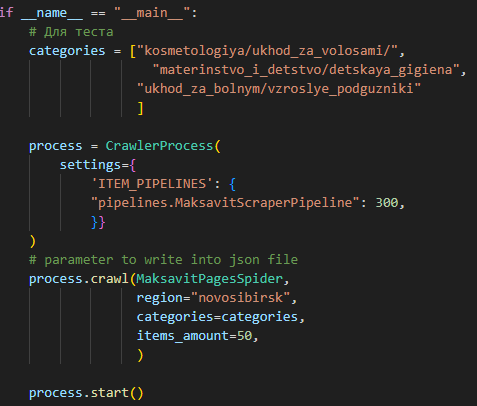
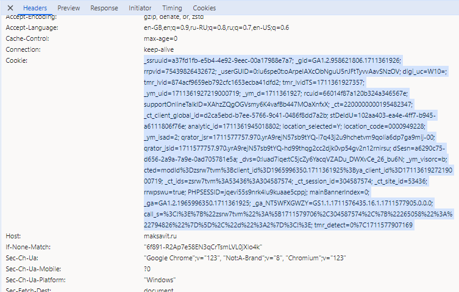

# Спайдер для магазина maksavit на фреймворке Scrapy

### **Usage**

Я сделал так чтобы Вы могли запустить проект просто запуском модуля

```
python maksavit_pages.py
```

В categories поместите ссылки из путей до категорий которые хотите спарсить ( минимум 3 )

Укажите количество товаров для каждой категории в параметре items_amount

Укажите желаемый Вам регион в параметре region



### Важно

Для доступа к сайту нужны cookies, иначе 401. Cookies живут 15 минут

Я не реализовывал автоматическое добавление cookies, так как проект уже занял не мало времени

У меня есть 3 варианта решения данной проблемы, могу рассказать при встрече.

Если Вы всё таки хотите запустить проект, то перейдите на сайт и через панель разработчика скопируйте с запроса cookies



Далее перейдите в модуль cookies.py и просто поместите данные из буффера в переменную cookie_string


### **Дополнительно**

В middlewares я всё же сделал набросок для будущего решения проблемы с доступом.

Также пришлось сделать свой ItemPipeline потому что дефолтное поведение не декодировало unicode символы в нормальный текст

Ещё добавлю что я принял решение обернуть проход по категории и страницам товаров в один спайдер. Это не самый лучший способ, но я решил сэкономить время и сопроводил код комментариями, надеюсь не устанете разбираться!

Очень надеюсь на Ваш фидбек!

Спасибо за возможность пройти тестовое задание! Всего наилучшего
